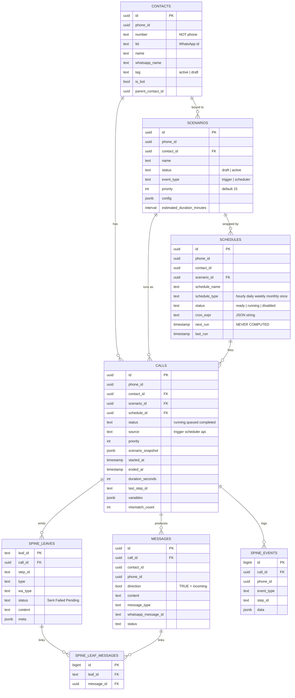
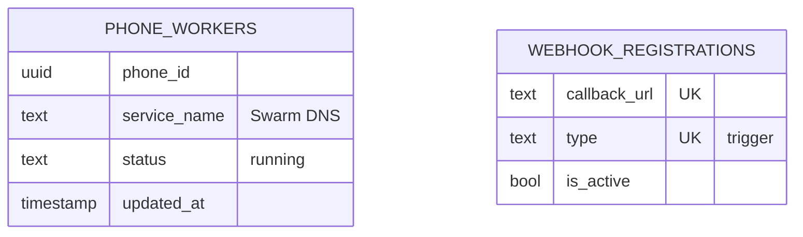

# Data Spine — ERD

סכמת ה-DB כפי שהיא **בפועל** (אומת מול `information_schema`), לא כפי שהקוד הניח.

---

## דיאגרמה



---

## טבלאות קונפיגורציה (לא מקושרות — בכוונה)

אלה **ספרי הכתובות** של שני המישורים. הן לא דאטה, ולכן אין להן FK.



| טבלה | מישור | מי כותב | מי קורא |
|------|-------|---------|---------|
| `phone_workers` | Spine → Worker | Provisioner + heartbeat | `_worker_url()` |
| `webhook_registrations` | HostAgent → Spine | **ה-Spine** (`registration_loop`) | `GetActiveWebhooksByTypeAsync` |

`unique (callback_url, type)` — עליו נשען ה-upsert העמיד ל-race.

---

## שלוש תובנות מה-ERD

**1. `calls` היא הצומת המרכזית.**
ארבעה FK נכנסים (`contact`, `scenario`, `schedule`, `phone`), שלוש טבלאות תלויות (`messages`, `spine_leaves`, `spine_events`).

זו הסיבה ש-`spine_calls` הייתה טעות — היא פיצלה את הצומת לשתיים, עם `status`/`phone_id`/`contact_id` כפולים ותלויים בסנכרון. **שדות ה-summary נכנסו ישירות ל-`calls`.**

**2. `contact_id` מופיע בשלוש טבלאות במקביל.**
`scenarios` · `schedules` · `calls` — והן חייבות להיות עקביות.
אם `schedules.contact_id ≠ scenarios.contact_id`, ה-scheduler ייצור call לאיש קשר שהתרחיש לא מיועד לו.

ה-`CreateModal` מונע את זה בצד ה-UI (`contactId: sc?.contact_id`), אבל **אין אילוץ ב-DB**. שווה לשקול:
```sql
-- אופציונלי: לאכוף שהתזמון תואם את התרחיש
alter table schedules add constraint schedules_contact_matches_scenario
  check (true);  -- דורש trigger, לא check פשוט
```

**3. `spine_leaves.leaf_id` הוא `text`** — החריגה היחידה בעולם של `uuid`.
זה תקין: המזהה מיוצר ב-Worker, לא ב-DB.

---

## מלכודות שמות

| נראה הגיוני | האמת |
|-------------|------|
| `contacts.phone` | **`contacts.number`** |
| `scenarios.is_published` | **`scenarios.status = 'active'`** |
| `scenarios.auto_trigger` | **לא קיים** — הקישור הוא `(phone_id, contact_id)` |
| `schedules.next_run_at` | **`schedules.next_run`** |
| `schedules.interval_seconds` | **`cron_expr`** (JSON string) |
| `spine_calls` | **לא קיימת מעולם** |
| `calls.id` = text | **`uuid`** |

**`contacts.tag = 'active'` ≠ `scenarios.status = 'active'`** — אותה מילה, שתי משמעויות שונות לגמרי.

---

## `direction` — קונבנציה יחידה

```
messages.direction = TRUE   →  נכנסת   (מאיש הקשר)
messages.direction = FALSE  →  יוצאת   (מהטלפון שלנו)
```

נגזר מ-`AddMessageAsync(..., direction: isIncoming)` ב-HostAgent.

> ה-Spine כתב קודם `direction=True` על הודעה **יוצאת** — היפוך מול ה-HostAgent, על אותה עמודה. תוקן ב-`send.py`.

---

## אינדקסים קריטיים

```sql
-- ה-invariant: call פעיל אחד לכל (טלפון, איש קשר)
create unique index uniq_running_call_per_contact
    on calls (phone_id, contact_id) where status = 'running';

-- התור
create index idx_calls_queued
    on calls (phone_id, contact_id, priority, created_at) where status = 'queued';

-- טאב Calls של תזמון / איש קשר
create index idx_calls_schedule     on calls (schedule_id, created_at desc);
create index idx_calls_contact_hist on calls (contact_id,  created_at desc);

-- ה-upsert של הרישום
alter table webhook_registrations
  add constraint webhook_registrations_url_type_key unique (callback_url, type);
```

---

## ⚠️ Timezone

כל ה-`timestamp` הם **`without time zone`** (נאיביים), וה-RPCs משתמשים ב-`now()` שמחזיר `timestamptz`.

באזור UTC+3 → **תזמונים יירו בהיסט של 3 שעות.** זה ייראה כמו "לא מדויק", לא כמו באג.

```sql
alter database postgres set timezone to 'UTC';
```
או להמיר את העמודות ל-`timestamptz`. **בחר אחד.**
